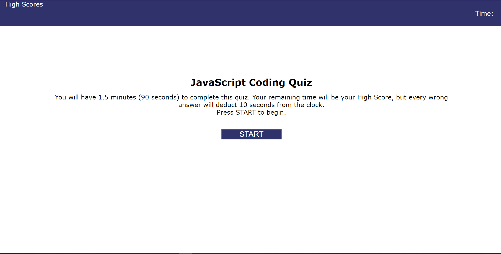

# Code Quiz on JavaScript Fundamentals (Under Construction)

## Languages 
* CSS
* HTML
* JavaScript

## Functionality
This quiz contains six questions and is timed with a total of 90 seconds to complete. 10 seconds are deducted from the timer when a question is answered incorrectly. The remaining time in the quiz timer counts as the quiz taker's score. After the quiz they will be prompted to enter their initials at the end of the quiz to hold their score.

## Screenshot

